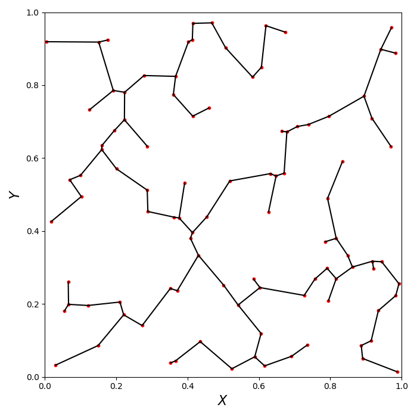

=====================
Minimum Spanning Tree
=====================

Tutorials
=========

Basic Usage
-----------

To construct the minimum spanning tree (MST) from a data set we will usually
interact with the ``get_mst`` class. Unless you need to do something more sophisticated
with the MST you will not need to use the internal functions that are used by the class.

To initiate the class we will run:

.. code-block:: python

    import mistree as mist

    # For 2D
    mst = mist.GetMST(x=x, y=y)

    # For 3D
    mst = mist.GetMST(x=x, y=y, z=z)

    # For tomographic coordinates
    mst = mist.GetMST(phi=phi, theta=theta)

    # For tomographic celestial coordinates
    mst = mist.GetMST(ra=ra, dec=dec)

    # For spherical polar coordinates
    mst = mist.GetMST(phi=phi, theta=theta, r=r)

    # For spherical celestial polar coordinates
    mst = mist.GetMST(ra=ra, dec=dec, r=r)

And to construct the MST and output the MST statistics: degree (d), edge length (l),
branch length (b) and branch shape (s):

.. code-block:: python

    d, l, b, s = mst.get_stats()

If you would also like the edge (``l_index``) and branch index (``b_index``),
this can be done in two ways:

.. code-block:: python

    d, l, b, s, l_index, b_index = mst.get_stats(include_index=True)

    # alternatively:

    d, l, b, s = mst.get_stats()
    l_index = mst.edge_index
    b_index = mst.branch_index

The edge index (``l_index``) is a 2 dimensional array, indicating the pair of nodes
that make up each edge. The branch index are list of the member edges in each branches.

To plot the MST, i.e. the nodes and edges you can use the following piece of python code
where we plot a set of 2D random points:

.. code-block:: python

    import numpy as np
    import matplotlib.pylab as plt
    import mistree as mist

    x = np.random.random_sample(100)
    y = np.random.random_sample(100)

    mst = mist.GetMST(x=x, y=y)
    d, l, b, s, l_index, b_index = mst.get_stats(include_index=True)

    plt.figure(figsize=(7., 7.))

    # plotting nodes:
    plt.scatter(x, y, s=10, color='r')

    # plotting MST edges:
    plt.plot([x[l_index[0]], x[l_index[1]]],
             [y[l_index[0]], y[l_index[1]]],
             color='k')

    plt.xlim(0., 1.)
    plt.ylim(0., 1.)
    plt.xlabel(r'$X$', size=16)
    plt.ylabel(r'$Y$', size=16)
    plt.tight_layout()
    plt.show()

If you would also like to plot branches then you can use the following piece of python code:

.. code-block:: python

    plt.figure(figsize=(7., 7.))

    # plotting nodes:
    plt.scatter(x, y, s=10, color='r')

    # plotting branches:
    for i in range(0, len(b_index)):
        plt.plot([x[l_index[0][b_index[i][0]]], x[l_index[1][b_index[i][0]]]],
                 [y[l_index[0][b_index[i][0]]], y[l_index[1][b_index[i][0]]]],
                 color='C0', linestyle=':')
        plt.plot([x[l_index[0][b_index[i][1:-1]]], x[l_index[1][b_index[i][1:-1]]]],
                 [y[l_index[0][b_index[i][1:-1]]], y[l_index[1][b_index[i][1:-1]]]],
                 color='C0')
        plt.plot([x[l_index[0][b_index[i][-1]]], x[l_index[1][b_index[i][-1]]]],
                 [y[l_index[0][b_index[i][-1]]], y[l_index[1][b_index[i][-1]]]],
                 color='C0', linestyle=':')

    # ploting MST edges:
    plt.plot([x[l_index[0]], x[l_index[1]]],
             [y[l_index[0]], y[l_index[1]]],
             color='grey', linewidth=2, alpha=0.25)

    plt.plot([], [], color='C0', label=r'$Branch$ $Mid$')
    plt.plot([], [], color='C0', label=r'$Branch$ $End$', linestyle=':')
    plt.plot([], [], color='grey', alpha=0.25, label=r'$MST$ $Edges$')
    plt.xlim(0., 1.)
    plt.ylim(0., 1.)
    plt.xlabel(r'$X$', size=16)
    plt.ylabel(r'$Y$', size=16)
    plt.legend(loc='best')
    plt.tight_layout()
    plt.show()

.. image:: img/mst_plot_mst_branches_2d.png
    :scale: 75 %
    :align: center

Advance Usage
-------------

k Nearest Neighbours
^^^^^^^^^^^^^^^^^^^^

The k-nearest neighbour graph is a spanning graph which is passed on to the
``scipy`` kruskal algorithm. The actual graph is constructed using the ``scikit-learn``
``kneighbors_graph`` and by default will include the nearest 20 neighbours to
each node. We can specify the number of nearest neighbours (we will set this to 30)
in the following way:

.. code-block:: python

    mst = mist.GetMST(x=x, y=y) # Assuming our input data set is 2D.
    mst.define_k_neighbours(30)
    d, l, b, s = mst.get_stats()

    # or directly:

    mst = mist.GetMST(x=x, y=y) # Assuming our input data set is 2D.
    d, l, b, s = mst.get_stats(k_neighbours=30)

Note: changing ``k`` to larger values will result in longer computation time to construct
the MST.

Scale Cuts
^^^^^^^^^^

In cosmological data sets we often need to remove small scales due to numerical
simulation or observational limitations. To remove this we carry out
the following:

.. code-block:: python

    x = np.random.random_sample(100000)
    y = np.random.random_sample(100000)

    mst = mist.GetMST(x=x, y=y)
    mst.scale_cut(0.002)
    d, l, b, s = mst.get_stats()

    # or directly:

    mst = mist.GetMST(x=x, y=y)
    d, l, b, s = mst.get_stats(scale_cut_length=0.002)

Functions
=========

Indepth documentation on the main classes and functions are provided below:

Main classes:

.. toctree::
   :maxdepth: 2

   basic_class

Functions:

.. toctree::
   :maxdepth: 1

   coordinates
   mst_branches
   mst_construct
   mst_density
   mst_graph
   mst_scale_cut
   mst_stats
   mst_tomo
